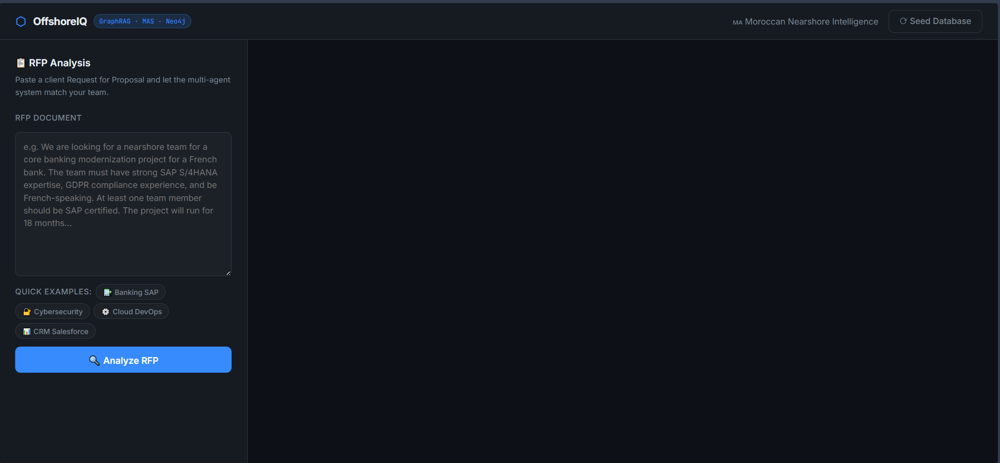
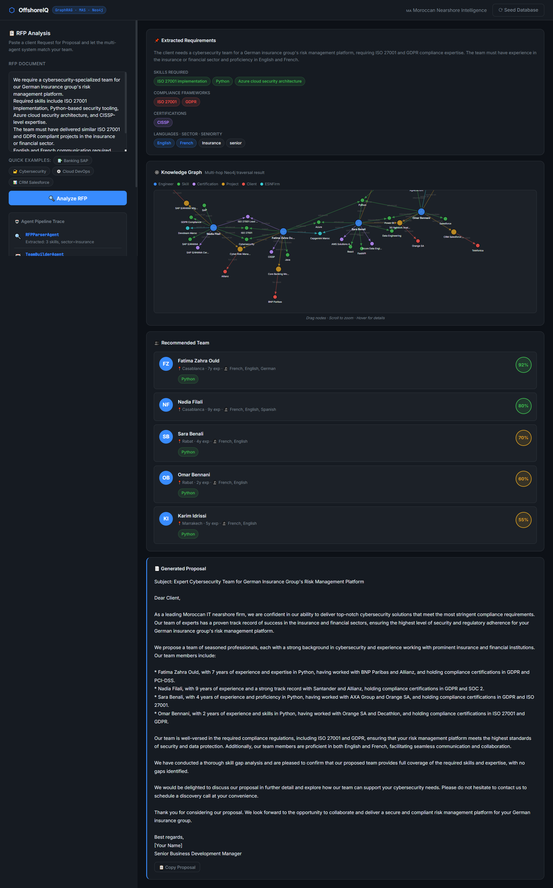
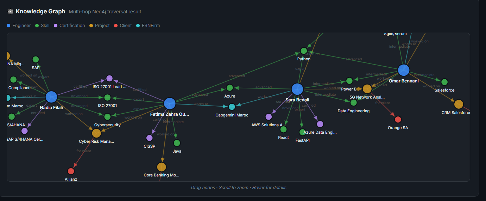
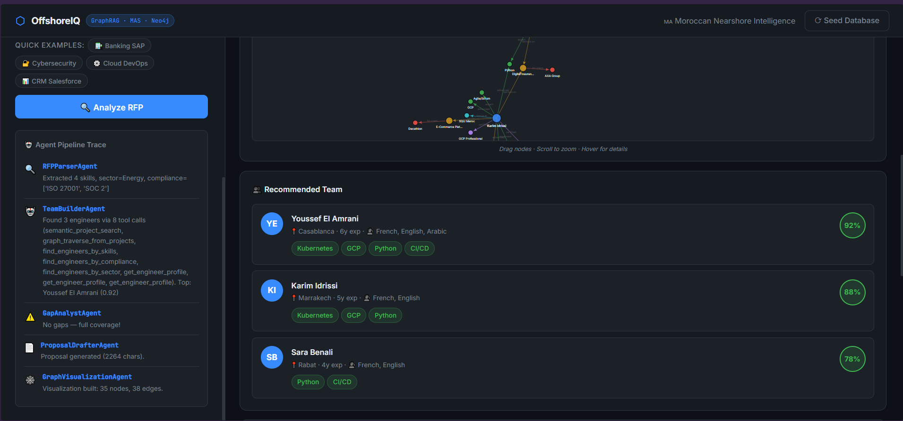

# ⬡ OffshoreIQ

> **Knowledge Graph + GraphRAG + Agentic Pipeline for Moroccan Nearshore IT Matching**
> ReAct Agents with Bound Tools · True GraphRAG (vector + graph) · Neo4j · LangGraph · FastAPI · Groq LLM
---

## 📸 Screenshots

### Main Interface


### RFP Analysis in Action


### Live Knowledge Graph (D3.js + Neo4j)


### Multi-Agent Pipeline Trace (showing tool calls)


---

## 🎯 What is OffshoreIQ?

OffshoreIQ is a **Proof of Concept** demonstrating **true GraphRAG** combined with an **Agentic Pipeline** applied to Morocco's nearshore IT offshoring sector.

### The Problem

When a French bank sends an RFP saying *"SAP S/4HANA team, GDPR compliance, French-speaking, 18 months"*, a Moroccan ESN firm currently responds manually over 2–4 weeks — digging through spreadsheets, calling team leads, assembling CVs by hand. OffshoreIQ does it in under 20 seconds.

---

## ⚙️ Technical Assessment

### ✅ True GraphRAG (vector similarity → graph traversal)

Implements the genuine two-step GraphRAG pattern:
```
Step 1 — Vector Search (semantic entry point):
  Embed the RFP text with sentence-transformers (all-MiniLM-L6-v2)
  Find the top-5 most semantically similar past projects in Neo4j vector index
  e.g. "banking modernization GDPR" → finds prj001, prj004 by cosine similarity

Step 2 — Graph Traversal (relational enrichment):
  Starting from those semantically matched project nodes,
  traverse the graph to find connected engineers, their skills,
  compliance history, certifications, and sector experience
  e.g. prj001 → [eng001, eng003, eng006] with full context
```

Neither step alone is sufficient:
- Step 1 alone: finds similar projects but can't tell you which engineers worked on them
- Step 2 alone: exact keyword matching misses semantic equivalents ("RGPD" vs "GDPR")
- Together: semantically aware entry + structured relational enrichment = GraphRAG

### ⚠️ Agentic Pipeline with ReAct agents — not a full MAS

Each agent has **tools bound via LangChain `bind_tools()`**. The LLM:
1. Receives the task and a list of available tools with their schemas
2. **Decides autonomously** which tools to call and in what order
3. Receives tool results back as `ToolMessage` objects
4. Loops — inspects results, calls more tools if needed, reasons toward a conclusion
5. Produces a structured final answer

This is the **ReAct (Reason + Act) pattern** and the tool-calling is genuine.

**What this is NOT:** agents do not communicate peer-to-peer. There is no supervisor dynamically routing between them. The pipeline is linear — each agent runs, finishes, and hands off via shared LangGraph state. A true MAS in the academic sense requires dynamic inter-agent communication, which this doesn't have.

**Accurate label: an agentic pipeline where each step is a real ReAct agent with tool use.**

---

## 🏗️ Architecture

```
Browser → POST /api/v1/rfp/analyze
              │
              ▼
    ┌─────────────────────────────────────────┐
    │         LangGraph StateGraph            │
    │   (5 nodes, shared state, append-only   │
    │    agent_trace accumulates across all)  │
    └─────────────────────────────────────────┘
              │
    ┌─────────▼──────────────────────────────────────────────┐
    │  ① RFPParserAgent  (LLM, structured JSON output)       │
    │     Input:  raw RFP text                               │
    │     Output: skills[], compliance[], sector, languages  │
    └─────────┬──────────────────────────────────────────────┘
              │
    ┌─────────▼──────────────────────────────────────────────┐
    │  ② TeamBuilderAgent  (ReAct agent, 6 bound tools)      │
    │                                                        │
    │  Tools the LLM can call autonomously:                  │
    │  ┌─────────────────────────────────────────────────┐   │
    │  │ semantic_project_search(query)                  │   │
    │  │   → embed query, cosine search Neo4j vector idx │   │
    │  │   → returns top-5 similar project IDs + scores  │   │
    │  │                                      GraphRAG①  │   │
    │  ├─────────────────────────────────────────────────┤   │
    │  │ graph_traverse_from_projects(project_ids)       │   │
    │  │   → traverse: Project→Engineer + full context   │   │
    │  │   → returns engineers with skills/compliance    │   │
    │  │                                      GraphRAG②  │   │
    │  ├─────────────────────────────────────────────────┤   │
    │  │ find_engineers_by_skills(skills)                │   │
    │  │   → 2-hop: Engineer→HAS_SKILL→Skill             │   │
    │  ├─────────────────────────────────────────────────┤   │
    │  │ find_engineers_by_compliance(frameworks)        │   │
    │  │   → 3-hop: Engineer→WORKED_ON→Project           │   │
    │  │            →REQUIRED_COMPLIANCE→Framework       │   │
    │  ├─────────────────────────────────────────────────┤   │
    │  │ find_engineers_by_sector(sector)                │   │
    │  │   → 4-hop: Engineer→WORKED_ON→Project           │   │
    │  │            →FOR_CLIENT→Client→IN_SECTOR→Sector  │   │
    │  ├─────────────────────────────────────────────────┤   │
    │  │ get_engineer_profile(engineer_id)               │   │
    │  │   → full profile: skills+certs+projects+clients │   │
    │  └─────────────────────────────────────────────────┘   │
    │                                                        │
    │  LLM loop: call tools → get ToolMessage → reason       │
    │            → call more tools → final JSON answer       │
    └─────────┬──────────────────────────────────────────────┘
              │
    ┌─────────▼──────────────────────────────────────────────┐
    │  ③ GapAnalystAgent  (ReAct agent, 2 bound tools)       │
    │                                                        │
    │  Tools:                                                │
    │  • get_team_skill_coverage(engineer_ids)               │
    │      → what skills does the team already have?         │
    │  • identify_skill_gaps(required_skills, engineer_ids)  │
    │      → Neo4j set-difference: required MINUS covered    │
    │                                                        │
    │  LLM calls both, reasons about gaps, generates         │
    │  Morocco-specific suggestions per uncovered skill      │
    └─────────┬──────────────────────────────────────────────┘
              │
    ┌─────────▼──────────────────────────────────────────────┐
    │  ④ ProposalDrafterAgent  (LLM, no tools)               │
    │     Generates 400-word client-ready proposal           │
    │     grounded in real graph data from prior agents      │
    └─────────┬──────────────────────────────────────────────┘
              │
    ┌─────────▼──────────────────────────────────────────────┐
    │  ⑤ GraphVisualizationAgent  (Neo4j only, no LLM)       │
    │     Builds D3.js payload: nodes + edges subgraph       │
    └─────────┬──────────────────────────────────────────────┘
              ▼
    FastAPI → JSON → Browser
    (engineer cards, D3 force graph, agent trace with tool calls, proposal)
```

### The Graph Schema (Neo4j)

```
(Engineer)-[:HAS_SKILL {proficiency: "expert|advanced|intermediate"}]→(Skill)
(Engineer)-[:HOLDS_CERT]→(Certification)
(Engineer)-[:WORKED_ON]→(Project {embedding: [...384 floats...]})
(Engineer)-[:WORKS_AT]→(ESNFirm)
(Project)-[:FOR_CLIENT]→(Client)
(Project)-[:REQUIRED_SKILL]→(Skill)
(Project)-[:REQUIRED_COMPLIANCE]→(ComplianceFramework)
(Project)-[:DELIVERED_BY]→(ESNFirm)
(Client)-[:IN_SECTOR]→(Sector)
```

`Project.embedding` is a 384-dimensional vector (all-MiniLM-L6-v2) stored directly on the node, indexed by Neo4j's native vector index for cosine similarity search.

---

## 🤖 The Agents

### Agent 1 — RFPParserAgent
Structured LLM call (not a tool-using agent — parsing is deterministic enough that a single LLM call with a strict JSON prompt is the right tool). Normalizes multilingual, free-text RFPs into typed structured fields. Falls back to safe defaults on parse failure.

### Agent 2 — TeamBuilderAgent *(ReAct agent)*
Has 6 tools bound via `bind_tools()`. Typical autonomous tool call sequence:
1. `semantic_project_search` → finds similar past projects by embedding similarity
2. `graph_traverse_from_projects` → traverses graph to connected engineers
3. `find_engineers_by_skills` → supplements with exact skill matches
4. `find_engineers_by_compliance` → verifies hands-on compliance experience
5. `get_engineer_profile` × N → deep-dives on top candidates before final answer

The LLM decides this sequence — it's not hardcoded.

### Agent 3 — GapAnalystAgent *(ReAct agent)*
Has 2 tools. Calls `get_team_skill_coverage` first to understand what exists, then `identify_skill_gaps` to find what's missing. Generates Morocco-specific suggestions: Simplon.co Maroc, UM6P, ENSIAS, GDG Casablanca, specific ESN firms.

### Agent 4 — ProposalDrafterAgent
Pure LLM generation grounded in structured context from Agents 1–3. No tools needed — the context is already fully structured.

---

## 🕸️ GraphRAG vs. Vector Search vs. Plain Graph Retrieval

| Approach | How it works | What it misses |
|---|---|---|
| **Vector / cosine search** | Embeds query, finds similar documents | Can't follow relationships — doesn't know an engineer worked on a project |
| **Plain graph retrieval** | Cypher exact-match queries | Misses semantic equivalents — "RGPD" ≠ "GDPR" without normalization |
| **GraphRAG (this project)** | Vector search finds entry nodes → graph traversal enriches | Best of both: semantic awareness + relational depth |

---

## 🚀 Quick Start

### Prerequisites
- Python 3.11+
- Neo4j Desktop **or** Docker
- Free [Groq API key](https://console.groq.com) (30 seconds)

### Local Setup

```bash
git clone https://github.com/Othamane/OffshoreIQ.git
cd offshoreiq

python -m venv venv
venv\Scripts\activate        # Windows
# source venv/bin/activate   # Mac/Linux

pip install -r requirements.txt   # includes sentence-transformers
```

Configure `.env`:
```env
GROQ_API_KEY=gsk_your_key_here
NEO4J_URI=bolt://localhost:7687
NEO4J_USER=neo4j
NEO4J_PASSWORD=your_neo4j_password
LLM_MODEL=llama-3.3-70b-versatile
```

```bash
uvicorn app.main:app --reload --port 8000
```

Open `http://localhost:8000` → click **⟳ Seed Database**.

> **First seed takes ~30s extra** — downloads the `all-MiniLM-L6-v2` embedding model (80MB, CPU-only, cached after first run), creates the Neo4j vector index, and embeds all 8 project descriptions.

### Docker Compose

```bash
cp .env.example .env   # set GROQ_API_KEY
docker compose up --build
curl -X POST http://localhost:8000/api/v1/admin/seed
```

---

## 🔑 Groq API Key (Free)

1. [console.groq.com](https://console.groq.com) → sign up → Create API Key
2. Set `LLM_MODEL=llama-3.3-70b-versatile` in `.env`

---

## 📡 API Reference

| Method | Endpoint | Description |
|---|---|---|
| `GET` | `/` | Web UI |
| `GET` | `/api/v1/health` | Health check |
| `POST` | `/api/v1/admin/seed` | Seed Neo4j + create vector index + embed projects |
| `POST` | `/api/v1/rfp/analyze` | Run the full MAS + GraphRAG pipeline |
| `GET` | `/docs` | Swagger UI |

---

## 📂 Project Structure

```
offshoreiq/
├── app/
│   ├── agents/
│   │   ├── orchestrator.py           # LangGraph StateGraph — 5 nodes
│   │   ├── rfp_parser_agent.py       # Agent 1: structured JSON extraction
│   │   ├── team_builder_agent.py     # Agent 2: ReAct agent, 6 bound tools, GraphRAG
│   │   ├── gap_analyst_agent.py      # Agent 3: ReAct agent, 2 bound tools
│   │   ├── proposal_drafter_agent.py # Agent 4: LLM proposal generation
│   │   └── llm_provider.py           # Groq LLM singleton
│   ├── api/
│   │   └── routes.py                 # FastAPI endpoints
│   ├── core/
│   │   ├── config.py                 # Pydantic Settings
│   │   └── logging.py                # Structured logging
│   ├── db/
│   │   ├── neo4j_db.py               # Neo4j driver singleton
│   │   └── seeder.py                 # Data + vector index + embeddings
│   ├── models/
│   │   └── schemas.py                # Pydantic I/O models
│   ├── services/
│   │   ├── graphrag_service.py       # Multi-hop Cypher queries
│   │   └── embedding_service.py      # sentence-transformers + Neo4j vector index
│   ├── static/css/main.css
│   ├── static/js/main.js             # D3.js force graph + UI
│   ├── templates/index.html
│   └── main.py
├── tests/test_api.py
├── .env.example
├── Dockerfile
├── docker-compose.yml
└── requirements.txt
```

---

## 🌍 Simulated Dataset

| Entity | Count | Details |
|---|---|---|
| Engineers | 8 | Across Casablanca, Rabat, Marrakech |
| ESN Firms | 5 | CGI Morocco, Capgemini Maroc, SQLI, Devoteam, NearShore Makers |
| Clients | 8 | BNP Paribas, AXA, Orange, Santander, TotalEnergies... |
| Projects | 8 | Each with a rich description **embedded as a 384-dim vector** |
| Skills | 25 | Python, SAP S/4HANA, Kubernetes, Salesforce... |
| Certifications | 8 | AWS SA, SAP S/4HANA, CISSP, ISO 27001 Lead Auditor... |
| Compliance Frameworks | 5 | GDPR, ISO 27001, PCI-DSS, SOC 2, HDS |
| Graph Relationships | 40+ | HAS_SKILL, WORKED_ON, FOR_CLIENT, IN_SECTOR, HOLDS_CERT... |

---

## 🧪 Tests

```bash
pip install pytest httpx
pytest tests/ -v
```

---

## 🔮 Roadmap

| Extension | Effort | What it adds |
|---|---|---|
| Embed engineer bio/CV text for semantic profile search | Low | Richer GraphRAG entry points |
| Conditional edges in LangGraph (retry on low confidence) | Medium | True agentic branching, not linear pipeline |
| JWT auth | Low | Multi-tenant access per ESN firm |
| PDF proposal export | Low | Downloadable formatted proposal |
| Neo4j GDS centrality scoring | Medium | Rank engineers by network influence |
| Availability + rate card nodes | Medium | Budget and timeline-aware matching |

---

## 🇲🇦 Moroccan Market Context

Morocco's nearshore IT sector serves 500+ ESN firms targeting French and Spanish multinationals, generating ~$2B/year with ~100,000 engineers. Hubs: Casablanca (CFC, Casanearshore), Rabat (Technopolis), Marrakech.

The RFP-to-proposal process this automates currently takes 2–4 weeks manually at firms like SQLI Maroc, Devoteam Maroc, and Capgemini Maroc.

---

## 📄 License

MIT

---

*Stack: FastAPI · Neo4j (graph + vector index) · LangGraph · LangChain · sentence-transformers · Groq LLM · D3.js*
